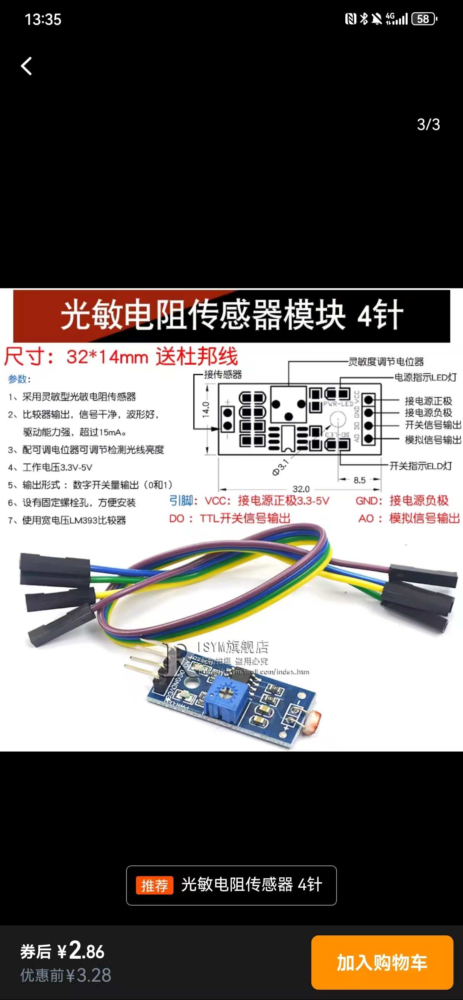

# Pi5 光敏电阻示例

本仓库示范了如何在 Raspberry Pi 5 上使用光敏电阻测量环境光照强度。

## 接线

按照以下方式连接发射端：
1. **VCC** → 5V（GPIO 针脚 2 或 4）
2. **GND** → 任意地线针脚
3. **DATA** → 默认连接至 GPIO17（可使用 `--pin` 参数修改）
## 运行示例

确保已安装 `RPi.GPIO`，然后执行:

```bash
python3 read_photoresistor.py
```

脚本每秒打印一次测定的光照值。

## 实物照片


## License

MIT
